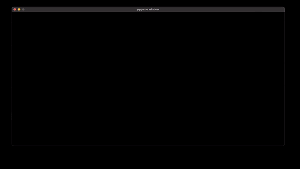

# N-Body-Problem

## abstract

The N-Body-Problem is a problem in physics. It aims to model the interaction of many different bodies in the universe, all who excert gravitiational forces on eachother.

In the following set of algorithms, the problem is approximately solved in 2+1D space using some fairly elementary techniques and formulae

We go further, and send the computationally-intense calculations to an FPGA board for execution, and then read them back into the host program for optimum performance

> read more on this project [here](https://tome.app/metagrok/optimisation-pynq-z2-clflkensa05ace840x533ue4j)



## set-up environment

> set access rights

```
chmod a+x run.sh
chmod a+x dependencies.sh
```

> virtual environment

```
python3 -m venv .
```

```
source ./bin/activate
```

> install dependecies 

```
./dependencies.sh
```

## tests on host

```
./run.sh
```

----

> [this](./IR/) directory acts as a sort of intermediate representation between the [C++ ](./C++/) solution to the nbp and the lower level HLS solution

> > it also includes a test harness - ideal inputs and outputs

----

## run accelerator on Z2

> follow the [accelerator directory](./Accelerator/)

> > on low spec machines - this system will at the least `4X` the native python implementation

----

## additions

> check out the [Python](./Python/) subdirectory for some interesting 3d visualisations!